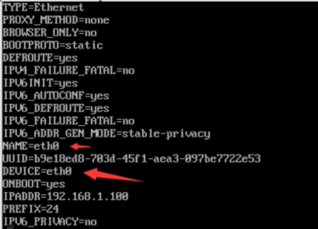
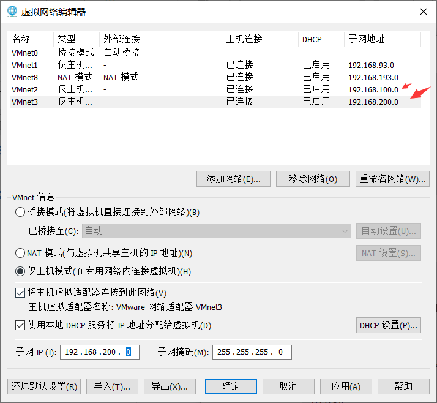
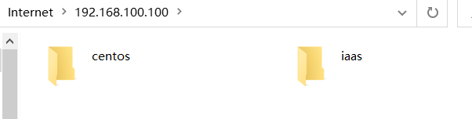

---

title: zhou
tags: 模板
category: /日记/2022-09
renderNumberedHeading: true
grammar_cjkRuby: true

---

### NAT模式

    子网IP：192.168.100.0
    子网掩码：255.255.255.0
     网关IP:192.168.100.2
     DNS：144.144.144.144

### NAT模式的DHCP设置

    起始IP地址：192.168.100.1
    结束IP地址：192.168.100.254

### 修改网卡名称

    在安装界面按tab键，在quiet前添加：
    net.ifnames=0 biosdevname=0
    从0 开始第二张网卡就是1  或者
    
    vi /etc/default/grub

#增加
这里俩张网卡
    GRUB_CMDLINE_LINUX="... net.ifnames=0 biosdevname=0
     net.ifnames=1 biosdevname=1" #...表示保留原来配置 在后面增加
    grub2-mkconfig -o /boot/grub2/grub.cfg
    reboot

 修改网卡:
 

### 基本配置

    controller:
    100G+6G+4cpu
    compute:
    100G+4G+100G+4cpu




### controller

    网络与主机名
    eth33
    IP地址:192.168.100.100
    子网掩码:24
    网关：192.168.100.2
    DNS：114.114.114.114
    
    eth34
    IP地址：192.168.200.100
    子网掩码：24
    网关：192.168.200.2
    DNS：114.114.114.114

### computer

    eth33
    IP地址:192.168.100.200
    子网掩码:24
    网关：192.168.100.2
    DNS：114.114.114.114
    
    eth34
    IP地址：192.168.200.200
    子网掩码：24
    网关：192.168.200.2
    DNS：114.114.114.114

网卡配置
controller:
vi  /etc/sysconfig/network-scripts/ifcfg-eth0
    BOOTPROTO=static
    ONBOOT=yes

vi  /etc/sysconfig/network-scripts/ifcfg-eth1
    BOOTPROTO=static
    ONBOOT=yes

### 查看ip：

    ip addr

### 重启网络

systemctl restart network

### 停止防火墙

systemctl stop firewalld  

### 永久关闭防火墙

systemctl disable firewalld 

### selinux
### 临时关闭（重启失效）

setenforce 0 
### 查看状态

sestatus
### 查看设置

getenforce

###### 或者（修改配置文件永久生效需要重启）
```
vi /etc/selinux/config
SELINUX=enforcing改成SELINUX=disabled
```

### (1)设置主机名：

    controller:
    hostnamectl set-hostname controller
    exec bash
    
    compute:
    hostnamectl set-hostname compute
    exec bash

### （2）controller/compute

    vi /etc/hosts
    192.168.100.100 controller
    192.168.100.200 compute


### （3）controller(本地yum源)
```
mkdir /opt/centos
mkdir /opt/iaas
```


### 挂载iso文件（先把centos7.5和iaas镜像拉到controller节点中）
```
controller:
    mount -o loop CentOS-7-x86_64-DVD-1804.iso /mnt/
	cp -rvf /mnt/* /opt/centos/
	umount /mnt/
	
	mount -o loop chinaskills_cloud_iaas.iso /mnt
	cp -rvf /mnt/* /opt/iaas/
	umount /mnt/

controller/compute:
吧原来的yum源移走或备份
mv /etc/yum.repos.d/* /home/
```

###### 编辑yum源文件

controller：
`vi /etc/yum.repos.d/local.repo`
```
[centos]
name=centos
baseurl=file:///opt/centos
gpgcheck=0
enabled=1
[iaas]
name=iaas
baseurl=file:///opt/iaas/iaas-repo
gpgcheck=0
enabled=1
```
compute
`vi /etc/yum.repos.d/ftp.repo`

```
[centos]
name=centos
baseurl=ftp://controller/centos
gpgcheck=0
enabled=1
[iaas]
name=iaas
baseurl=ftp://controller/iaas/iaas-repo
gpgcheck=0
enabled=1
```

###### controller/compute:
yum clean all
yum repolist
yum makecache

###### 在执行compute的该命令前，先在controller将ftp安装好

##### FTP:controller
```
yum install -y vsftpd
vi /etc/vsftpd/vsftpd.conf
添加
anon_root=/opt

systemctl restart vsftpd
systemctl enable vsftpd
```



### （4）时间同步

### （5）磁盘分区（compute）

`lsblk`
